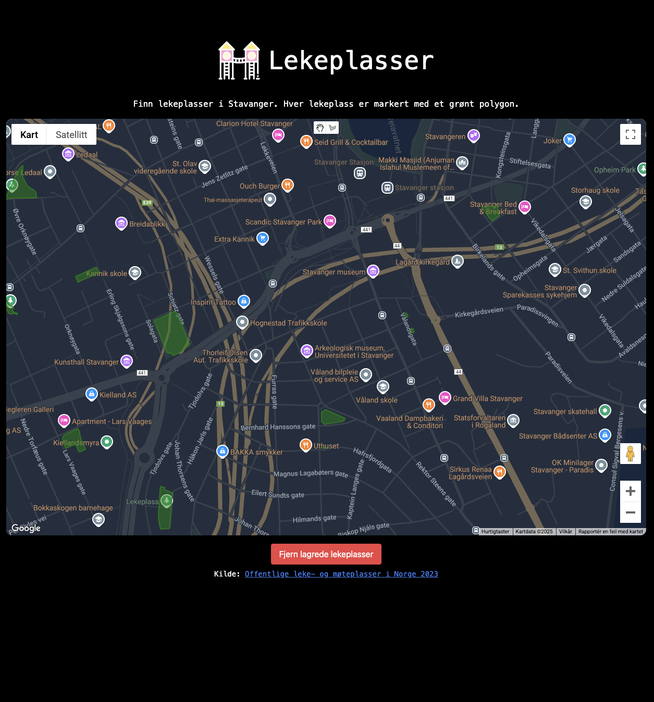

# Lekeplasser

Lekeplasser er en enkel side for å se lekeplasser i Norge.



## Features

- View lekeplasser
- Interactive map
- Responsive design

## Tech Stack

- Svelte
- SvelteKit
- TypeScript
- Tailwind CSS
- Google Maps API

## Development

```sh
npm install
npm run dev
```

Åpne [http://localhost:5173](http://localhost:5173) i nettleseren for å se applikasjonen kjøre.

## Se appen live

Applikasjonen er enkelt hostet hos Netlify [lekeplasser.netlify.app](https://lekeplasser.netlify.app).
